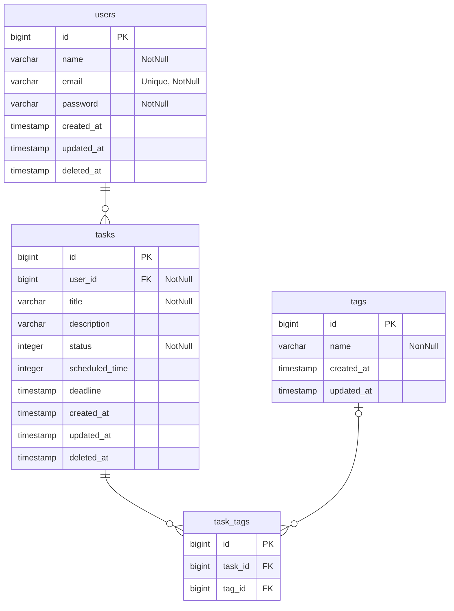

# ER 図

```mermaid

erDiagram
  tasks {
    bigint id PK
    bigint user_id FK "NotNull"
    varchar title "NotNull"
    varchar description
    integer status "NotNull"
    integer scheduled_time
    timestamp deadline
    timestamp created_at
    timestamp updated_at
    timestamp deleted_at
  }

  users {
    bigint id PK
    varchar name "NotNull"
    varchar email "Unique, NotNull"
    varchar password "NotNull"
    timestamp created_at
    timestamp updated_at
    timestamp deleted_at
  }

  tags {
    bigint id PK
    varchar name "NonNull"
    timestamp created_at
    timestamp updated_at
  }

  task_tags {
    bigint id PK
    bigint task_id FK
    bigint tag_id FK
  }

  users ||--o{ tasks : ""
  tasks ||--o{ task_tags : ""
  tags |o--o{ task_tags : ""

```
