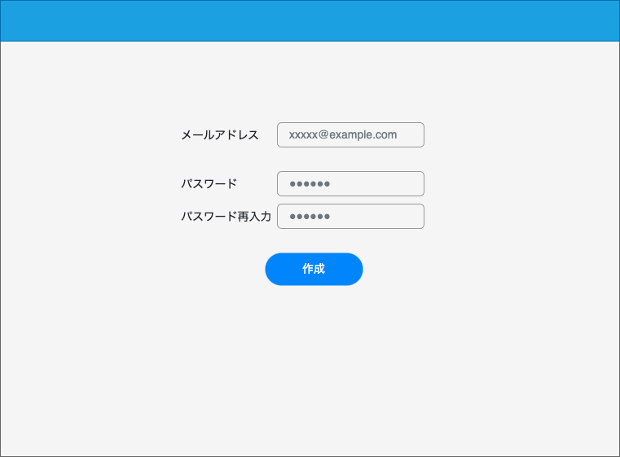

# 画面設計書

## 画面名

ユーザー作成画面

## 概要

<!-- 何をする・何ができる画面か) -->

- ユーザーを作成する

## アクセス制御

ログインのみ

## 画面イメージ

## 画面項目

### 項目一覧

| ID  | 項目名           | 種類   | 必須 | 表示/非表示 | 初期値 | 桁数 | フォーマット | 備考                         |
| --- | ---------------- | ------ | ---- | ----------- | ------ | ---- | ------------ | ---------------------------- |
| 1   | ヘッダー         |        |      | -           | -      | -    | -            |                              |
| 2-1 | メールアドレス   | Input  | ○    | -           | -      | -    | `e-mail形式` |                              |
| 2-2 | パスワード       | Input  | ○    | -           | -      | -    | -            | 8 文字以上、英数字、記号混合 |
| 2-3 | パスワード再入力 | Input  | ○    | -           | -      | -    | -            |                              |
| 3   | 作成ボタン       | Button |      | -           | -      | -    | -            |                              |
