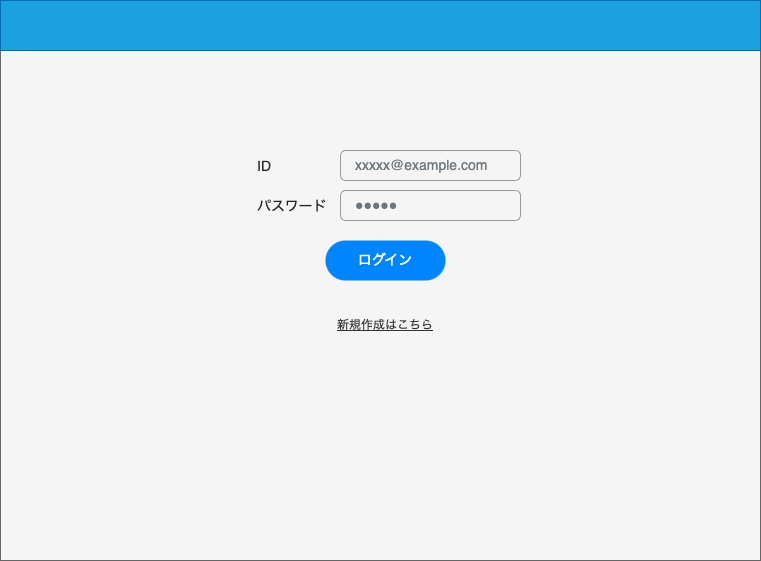

# 画面設計書

## 画面名

タスク一覧画面

## 概要

<!-- 何をする・何ができる画面か) -->

- ユーザーがログイン後に遷移する画面
- ユーザーが登録したタスクを一覧で見ることができる
- タスクのステータスを変えることができる
- タスクを検索することができる
- タスクを作成画面に遷移できる

## アクセス制御

ログインのみ

## 画面イメージ

## 画面項目

### 項目一覧

| ID  | 項目名           | 種類   | 必須 | 表示/非表示 | 初期値 | 桁数 | フォーマット | 備考 |
| --- | ---------------- | ------ | ---- | ----------- | ------ | ---- | ------------ | ---- |
| 1   | ヘッダー         |        |      | -           | -      | -    | -            |      |
| 2   | ID               | Input  | ○    | -           | -      | -    | `e-mail形式` |      |
| 3   | パスワード       | Input  | ○    | -           | -      | -    | -            |      |
| 4   | ログインボタン   | Button |      | -           | -      | -    | -            |      |
| 5   | 新規作成はこちら | Link   |      | -           | -      | -    | -            |      |
