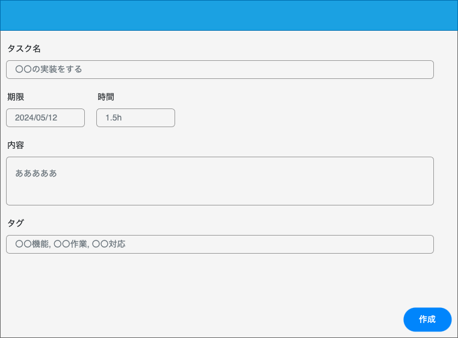

# 詳細画面設計書

## 画面名

タスク作成画面

## 概要

<!-- 何をする・何ができる画面か) -->

- タスクを作成する画面

## アクセス制御

ログインのみ

## 画面イメージ

## 画面項目

### 項目一覧

| ID  | 項目名             | 種類     | 必須 | 表示/非表示 | 初期値 | 桁数 | フォーマット | 備考 |
| --- | ------------------ | -------- | ---- | ----------- | ------ | ---- | ------------ | ---- |
| 1   | ヘッダー           |          |      | -           | -      | -    | -            |      |
| 2   | タスク名(タイトル) | Input    | ○    | -           | -      | 20   | -            |      |
| 3   | 期限               | Input    |      | -           | -      | 10   | `yyyy/MM/dd` |      |
| 4   | 時間               | Input    |      | -           | -      | 5    | `0.1h`       |      |
| 5   | 内容               | TextArea |      | -           | -      | -    | -            |      |
| 6   | タスク作成ボタン   | Button   |      | -           | -      | -    | -            |      |
