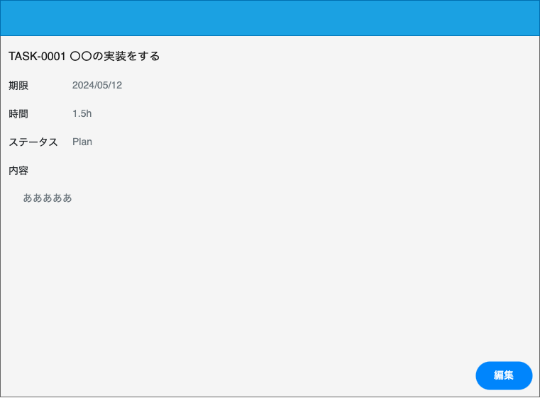

# 画面仕様書

## 画面名

タスク詳細画面

## 概要

<!-- 何をする・何ができる画面か) -->

- タスクの詳細を確認することができる

## アクセス制御

ログインのみ

## 画面イメージ

## 画面項目

### 項目一覧

| ID  | 項目名             | 種類 | 必須 | 表示/非表示 | 初期値 | 桁数 | フォーマット | 備考 |
| --- | ------------------ | ---- | ---- | ----------- | ------ | ---- | ------------ | ---- |
| 1   | ヘッダー           |      |      | -           | -      | -    | -            |      |
| 2-1 | タスク名(タイトル) | Text |      | -           | -      | -    | -            |      |
| 2-2 | 期限               | Text |      | -           | -      | -    | `yyyy/MM/dd` |      |
| 2-3 | 時間               | Text |      | -           | -      | -    | `0.1h`       |      |
| 2-4 | ステータス         | Text |      | -           | -      | -    |              |      |
| 2-5 | 内容               | Text |      | -           | -      | -    | -            |      |
| 2-6 | タグ               | Link |      | -           | -      | -    |              |      |
| 3   | タスク編集ボタン   | Link |      | -           | -      | -    | -            |      |
