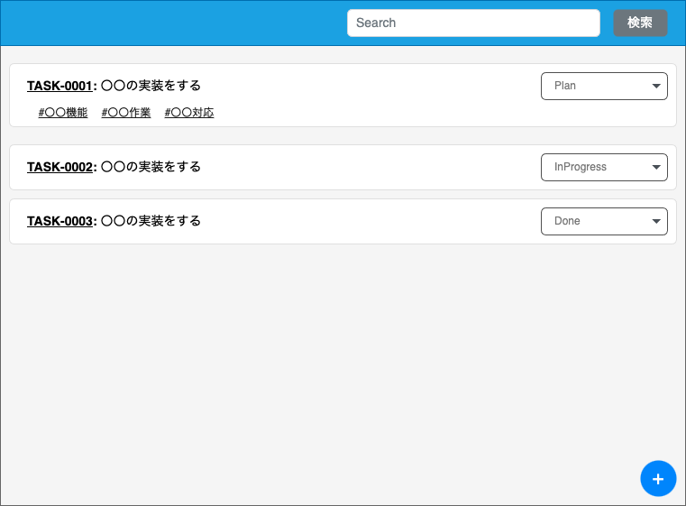

# 画面仕様書

## 画面名

タスク一覧画面

## 概要

<!-- 何をする・何ができる画面か) -->

- ユーザーがログイン後に遷移する画面
- ユーザーが登録したタスクを一覧で見ることができる
- タスクのステータスを変えることができる
- タスクを検索することができる
- タスクを作成画面に遷移できる

## アクセス制御

ログインのみ

## 画面イメージ

## 画面項目

### 項目一覧

| ID  | 項目名           | 種類   | 必須 | 表示/非表示 | 初期値 | 桁数 | フォーマット   | 備考 |
| --- | ---------------- | ------ | ---- | ----------- | ------ | ---- | -------------- | ---- |
| 1   | ヘッダー         |        |      | -           | -      | -    | -              |      |
| 1-1 | 検索欄           | Input  |      | -           | -      | 20   | -              |      |
| 1-2 | 検索ボタン       | Button |      | -           | -      | -    | -              |      |
| 2   | タスク           |        |      | -           | -      | -    | -              |      |
| 2-1 | タスク ID        | Link   |      | -           | -      | -    | `{ID}`         |      |
| 2-2 | タスク名         | Text   |      | -           | -      | -    | `: {タイトル}` |      |
| 2-3 | ステータス       | Select |      | -           | -      | -    | -              |      |
| 2-4 | タグ             | Link   |      | -           | -      | -    | `#{タグ名}`    |      |
| 3   | タスク追加ボタン | Button |      | -           | -      | -    | -              |      |
