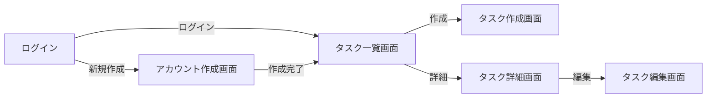

# 仕様書

## 画面一覧

- [ログイン画面](./screen_desgin/login_screen.md)
- [アカウント作成画面](./screen_desgin/create_user_screen.md)
- [タスク一覧画面](./screen_desgin/task_list_screen.md)
- [タスク詳細画面](./screen_desgin/task_detail_screen.md)
- [タスク作成画面](./screen_desgin/task_create_screen.md)
- [タスク編集画面](./screen_desgin/task_edit_screen.md)

## 画面遷移

## ER 図

- [ER 図](./er.md)

## 参考にしたサイト

- [基本設計書のテンプレート](https://note.com/optimal_sdw_com/n/ndfa3af81043f#90p6b)
- [documentation_templates](https://github.com/Foo-x/documentation_templates?tab=readme-ov-file)
- [YAML で画面設計書を書いて Markdown で出力する](https://qiita.com/endk/items/2ae6ab257f0ad42a3bd8)
- [初めての画面設計書](https://note.com/xytam/n/n795be7e53640)
