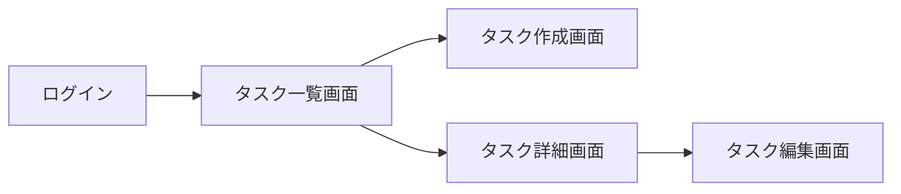

# 画面設計書

## 画面一覧

- [タスク一覧画面](./screen_desgin/task_list_screen.md)
- [タスク詳細画面](./screen_desgin/task_detail_screen.md)
- [タスク作成画面](./screen_desgin/task_create_screen.md)
- [タスク編集画面](./screen_desgin/task_edit_screen.md)

## 画面遷移

